# Project 2 — Azure Load Balancer + VM Scale Set + Autoscaling

This project demonstrates a highly available web application deployed on Azure using a **Virtual Machine Scale Set (VMSS)** behind a **Load Balancer (LB)**. The solution automatically scales based on CPU usage and distributes traffic evenly across instances.

---

## 📌 Architecture Overview

- **VNet + Subnet** for network isolation  
- **Public Load Balancer** with:
  - Frontend IP
  - Backend pool
  - Health probe
  - Load-balancing rules
- **VM Scale Set** (Linux)
  - Custom Script Extension installs web server
  - Autoscaling between 2–5 instances based on CPU
- **Scaling Rules**
  - Scale out: CPU > 60%
  - Scale in: CPU < 30%

---

## 🧩 What This Project Covers

- Creating a VNet + Subnet
- Deploying a Public Load Balancer
- Configuring:
  - Frontend IP
  - Health probe
  - Backend pool
  - Load balancing rule (port 80)
- Deploying a Linux VM Scale Set
- Adding a Custom Script Extension to install NGINX
- Scaling the VMSS to 2 instances
- Configuring Autoscale rules
- Testing the deployment from a web browser

---

## 🖼 Screenshots

### **1. Virtual Network & Subnet**
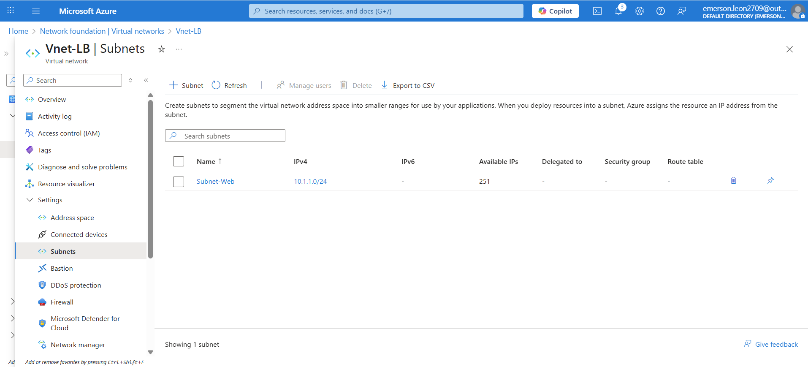
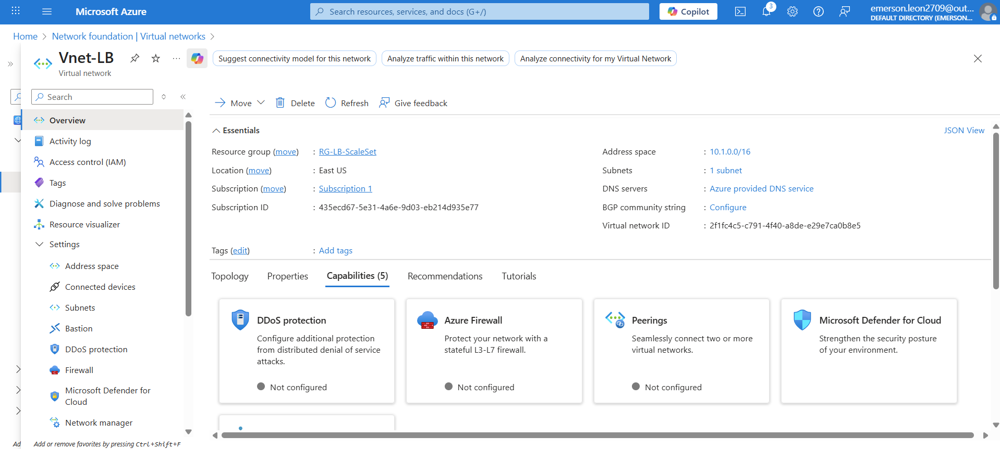

---

### **2. Load Balancer Configuration**
**Frontend IP**
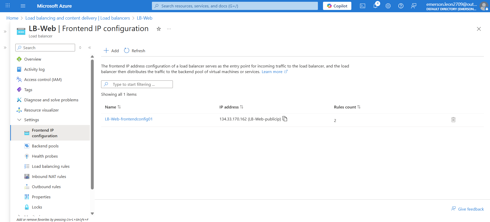

**Health Probe**
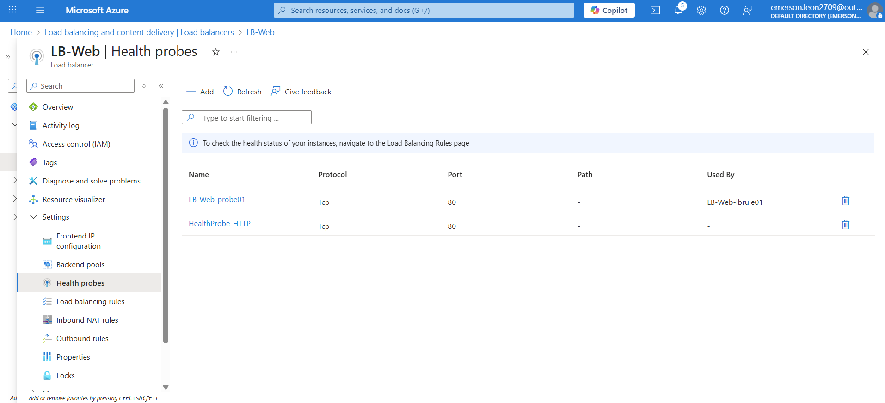

**Load Balancing Rule**
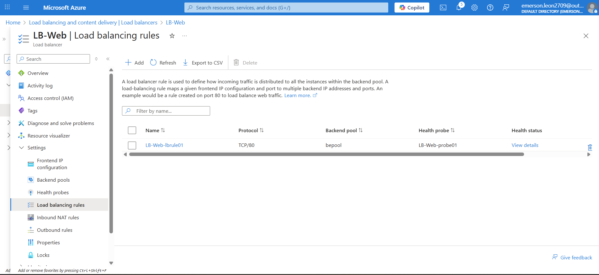

---

### **3. VM Scale Set Deployment**
**Resource Group overview**
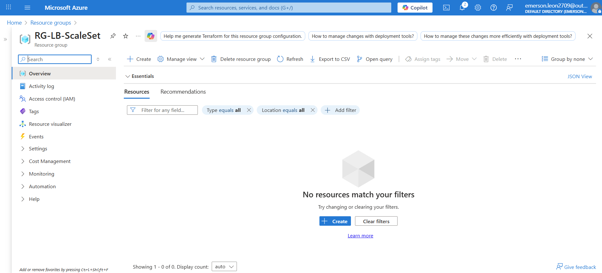

**VMSS deployed**
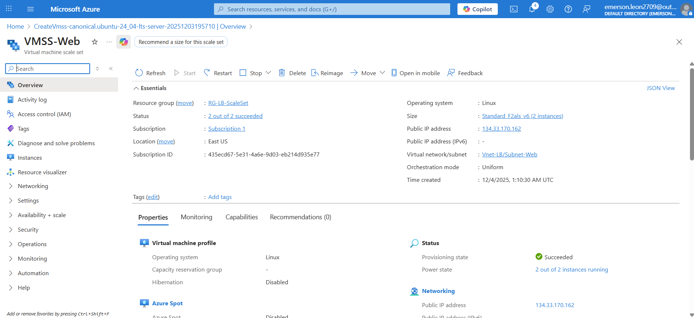

**Custom Script Extension**
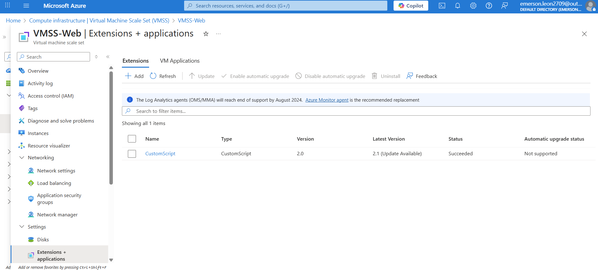

---

### **4. Scaling**
**After setting instance count to 2**
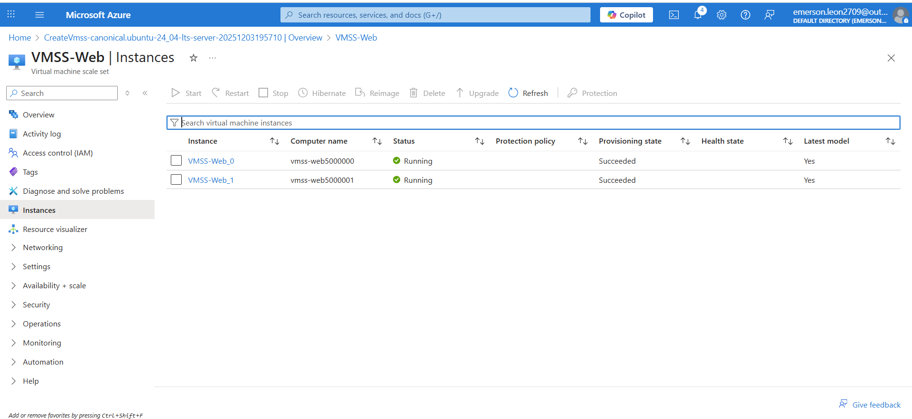

**Backend pool showing 2 healthy instances**
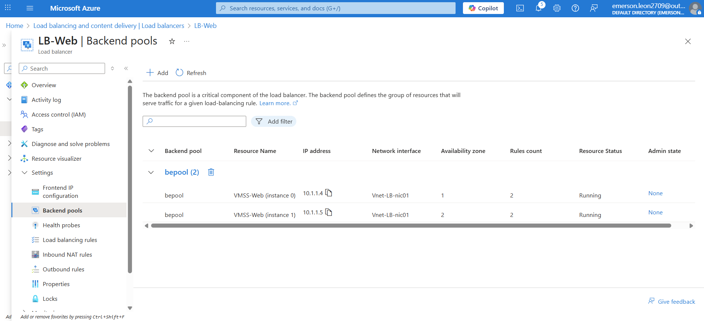

---

### **5. Autoscaling Configuration**
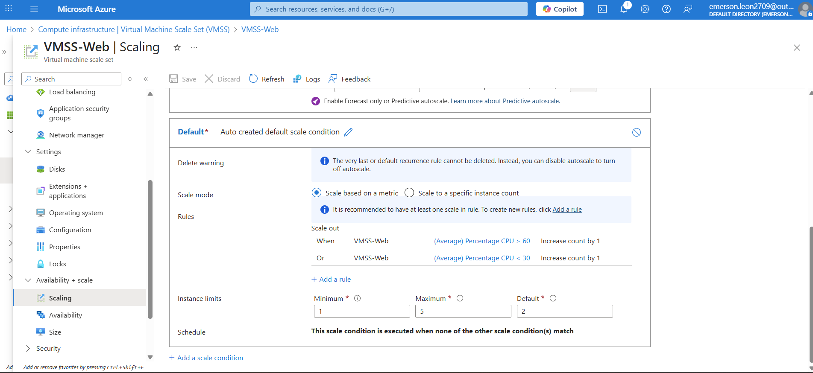

---

### **6. Testing the Web Page**
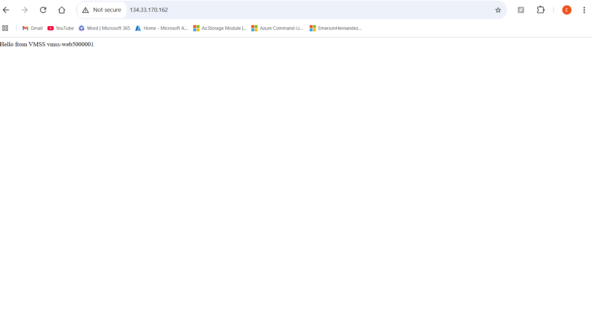

---

## 🚀 Learnings & Takeaways

Through this project, I practiced:

- Designing scalable cloud architectures
- Configuring load balancing for high availability
- Using VM Scale Sets for elasticity
- Automating deployments using Custom Script Extensions
- Implementing autoscaling rules based on metrics
- Understanding backend pools & health probes
- Troubleshooting Azure networking components

This setup is commonly used in production environments for web applications, APIs, and stateless services.

---

## 📁 Repository Structure
